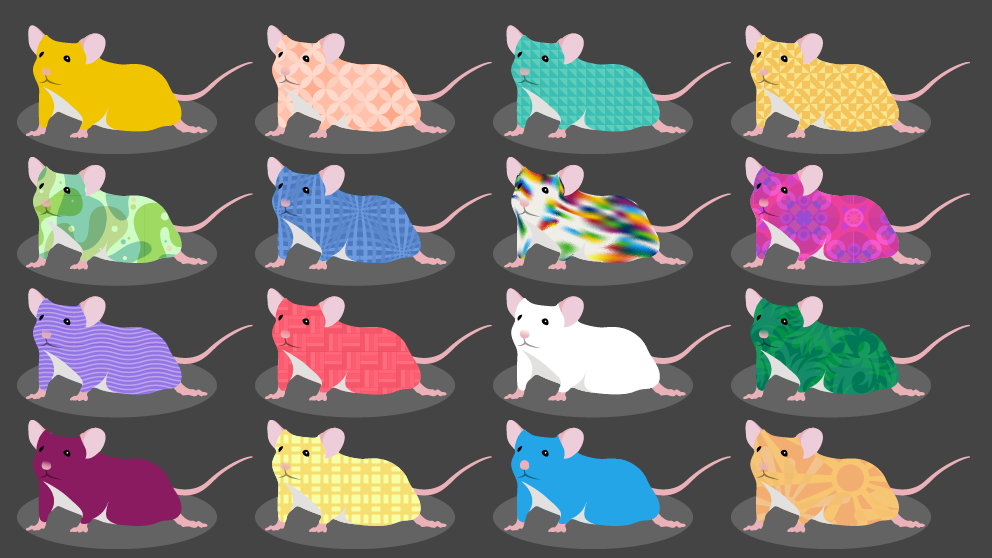

<!-- PROJECT SHIELDS -->
<!--
*** I'm using markdown "reference style" links for readability.
*** Reference links are enclosed in brackets [ ] instead of parentheses ( ).
*** See the bottom of this document for the declaration of the reference variables
*** for contributors-url, forks-url, etc. This is an optional, concise syntax you may use.
*** https://www.markdownguide.org/basic-syntax/#reference-style-links
-->
[![MIT License][license-shield]][license-url]
[![LinkedIn][linkedin-shield]][linkedin-url]


<!-- PROJECT LOGO -->
<br />
<p align="center">
  <a href="https://github.com/akirosingh/DOproject">
    
  </a>

  <h3 align="center">Diversity Outbred Malaria Project</h3>
 
  <p align="center">
    Here lies all the work I'm doing on Diversity Outbred mice and malaria infection. 
    <br />
    <a href="https://github.com/akirosingh/DOproject"><strong>Explore the docs »</strong></a>
    <br />
    <br />
    <a href="https://github.com/akirosingh/DOproject/issues">Report Bug</a>
    ·
    <a href="https://github.com/akirosingh/DOproject/issues">Request Feature</a>
  </p>
</p>


<!-- TABLE OF CONTENTS -->
<details open="open">
  <summary>Table of Contents</summary>
  <ol>
    <li>
      <a href="#about-the-project">About The Project</a>
    </li>
    <li>
      <ul>
        <li><a href="#description">Abstract</a></li>
      </ul>
    </li>
    <li><a href="#file-structure">File Structure</a></li>
    <li><a href="#roadmap">Roadmap</a></li>
    <li><a href="#license">License</a></li>
    <li><a href="#contact">Contact</a></li>
    <li><a href="#acknowledgements">Acknowledgements</a></li>
  </ol>
</details>


<!-- ABOUT THE PROJECT -->
## Diversity Outbred Project

[Insert paper link and pretty image]

<!-- DESCRIPTION-->
## Description

Approximately 500 diversity outbred mice were infected with *Plasmodium chabaudi* AJ. On a daily basis 5 days after infection, bodyweight (grams), temperature (celsius), Red Blood Cell Count (millions/uL of Blood), Parasitemia were calculated.

### File structure

```
.
├── DOproject.Rproj
├── LICENSE
├── R
│   ├── calculate_phenotypes.R
│   ├── create_control.R
│   ├── create_fig1.R
│   ├── create_fig2.R
│   ├── create_fig3.R
│   ├── create_fig4.R
│   ├── create_fig5.R
│   ├── create_foundergenofile.R
│   ├── create_genofile.R
│   ├── create_gmapfile.R
│   ├── create_phenotypes.R
│   ├── create_pmapfile.R
│   ├── create_supfig1.R
│   ├── create_supfig2.R
│   ├── get_arrayid.R
│   ├── get_gmap.R
│   ├── get_markers.R
│   ├── get_phenocovar.R
│   ├── get_pmap.R
│   ├── get_rawcovar.R
│   ├── get_rawfoundergenotypes.R
│   ├── get_rawgenotypes.R
│   ├── get_rawphenotypes.R
│   ├── get_sampleindex.R
│   ├── plan.R
│   └── zip_datafiles.R
├── README.md
├── _drake.R
├── data
│   ├── prepared_data
│   │   ├── controlfile.json
│   │   ├── covar.csv
│   │   ├── dataic.rds
│   │   ├── do_malaria.zip
│   │   ├── foundergeno.csv
│   │   ├── geno.csv
│   │   ├── gmap.csv
│   │   ├── grouped.rds
│   │   ├── pheno.csv
│   │   ├── phenotypes.rds
│   │   └── pmap.csv
│   └── raw_data
│       ├── array_id.csv
│       ├── char_review.xlsx
│       ├── markers.csv
│       ├── metadata.csv
│       ├── raw_genotype.csv
│       ├── raw_phenotype.csv
│       ├── sample_index.csv
│       └── ~$axiom8_samples.xlsx
├── doc
│   ├── manuscript.Rmd
│   └── manuscript.html
├── images
│   ├── Figure2.pdf
│   └── logo.png          #Placeholder image
└── packages.R
```

<!-- DEPENDENCIES -->
## Dependencies
Requires R and drake

Execute in Rstudio:

``` R
drake::r_make()
```

<!-- ROADMAP -->
## Roadmap

See the [open issues](https://github.com/akirosingh/DOproject/issues) for a list of proposed features (and known issues).

<!-- Resources -->
## Resources

https://kbroman.org/qtl2/assets/vignettes/user_guide.html

<table>
<colgroup>
<col style="width: 13%" />
<col style="width: 42%" />
<col style="width: 44%" />
</colgroup>
<thead>
<tr class="header">
<th style="text-align: center;">Tool</th>
<th style="text-align: center;">How to install?</th>
<th style="text-align: center;">How to learn?</th>
</tr>
</thead>
<tbody>
<tr class="odd">
<td style="text-align: center;"><!-- the backslash means newline --> <em>Windows only:</em><br />
Chocolately</td>
<td style="text-align: center;">Visit <a href="https://chocolatey.org/courses/installation/installing?method=installing-chocolatey">chocolatey.org</a>.</td>
<td style="text-align: center;">Chocolately installs software for you, it is installed and called from the terminal/command prompt.<br />
To open the comand prompt, press Windows+X and then click on “Command Prompt” or “Command Prompt (Admin).”</td>
</tr>
<tr class="even">
<td style="text-align: center;"><em>OS X only:</em><br />
Homebrew</td>
<td style="text-align: center;">Visit <a href="https://brew.sh">brew.sh</a>.</td>
<td style="text-align: center;">Homebrew installs software for you. It is installed and called from the terminal/command prompt.<br />
To open the terminal press Command + Space to open Spotlight and then type “Terminal” and double click on the top search result.</td>
</tr>
<tr class="odd">
<td style="text-align: center;">R</td>
<td style="text-align: center;"><strong>Windows:</strong><br />
Use Chocolately (from the terminal).<br />
<code>choco install -y r.project</code><br />
<br />
<strong>OS X:</strong><br />
Use Homebrew.<br />
<code>brew install r</code><br />
</td>
<td style="text-align: center;">Read: <a href="https://r4ds.had.co.nz">R for Data Science</a></td>
</tr>
<tr class="even">
<td style="text-align: center;">Rstudio</td>
<td style="text-align: center;"><strong>Windows:</strong><br />
Use Chocolately (from the terminal).<br />
<code>choco install -y r.studio</code><br />
<br />
<strong>OS X:</strong><br />
Use Homebrew (from the terminal).<br />
<code>brew cask install rstudio</code></td>
<td style="text-align: center;">Skim the <a href="https://www.rstudio.org/links/ide_cheat_sheet">cheatsheet</a></td>
</tr>
<tr class="odd">
<td style="text-align: center;">rmarkdown</td>
<td style="text-align: center;">Within Rstudio, type into the R-console:<br />
<code>install.packages(&quot;rmarkdown&quot;)</code></td>
<td style="text-align: center;">Read the <a href="https://www.rstudio.org/links/r_markdown_cheat_sheet">cheatsheet</a>. Skim <a href="https://bookdown.org/yihui/rmarkdown/">R Markdown: The Definitive Guide</a></td>
</tr>
<tr class="even">
<td style="text-align: center;">Git</td>
<td style="text-align: center;"><strong>Windows:</strong><br />
Use Chocolately (from the terminal).<br />
<code>choco install -y git</code><br />
<br />
<strong>OS X:</strong><br />
Git gets installed with Homebrew.<br />
Nothing to do.</td>
<td style="text-align: center;">Read <a href="https://happygitwithr.com/git-basics.html">Part IV Git fundamentals</a> And skim the rest of <a href="https://happygitwithr.com">Happy Git and Gitub for the useR</a>.</td>
</tr>
<tr class="odd">
<td style="text-align: center;">GitHub</td>
<td style="text-align: center;">Create an account on: <a href="https://github.com/join">github.com</a><br />
And apply for <a href="https://education.github.com/benefits">Student/Researcher Benefits</a></td>
<td style="text-align: center;">Read <a href="https://happygitwithr.com/connect-intro.html">Part II Connect Git, GitHub, RStudio</a> And <a href="https://happygitwithr.com">III Early GitHub Wins</a>.</td>
</tr>
<tr class="even">
<td style="text-align: center;">Make</td>
<td style="text-align: center;"><strong>Windows:</strong><br />
Use chocolately.<br />
<code>choco install -y make</code><br />
<br />
<strong>OS X:</strong><br />
Make is preinstalled on OS X.<br />
Nothing to do.</td>
<td style="text-align: center;">Read <a href="https://kbroman.org/minimal_make/">Minimal Make</a></td>
</tr>
</tbody>
</table>


<!-- LICENSE -->
## License

Distributed under the MIT License. See `LICENSE` for more information.

<!-- CONTACT -->
## Contact

Adam Kirosingh - adamsk@stanford.edu

Project Link: [https://github.com/akirosingh/DOproject](https://github.com/akirosingh/DOproject)


<!-- ACKNOWLEDGEMENTS -->
## Acknowledgements
Thanks to David Schneider and Prasanna Jagannathan and my committee, Taia Wang, Catherine Blish, and Bali Pulendran.
Thanks to my coauthors Avni Gupta, Victoria Chevee

Thank you Karl Broman for paving the way with your work on reproducible research and qtl mapping in R.
<!-- MARKDOWN LINKS & IMAGES -->
<!-- https://www.markdownguide.org/basic-syntax/#reference-style-links -->
[contributors-shield]: https://img.shields.io/github/contributors/akirosingh/DOproject.svg?style=for-the-badge
[contributors-url]: https://github.com/akirosingh/DOproject/graphs/contributors
[forks-shield]: https://img.shields.io/github/forks/akirosingh/DOproject.svg?style=for-the-badge
[forks-url]: https://github.com/akirosingh/DOproject/network/members
[stars-shield]: https://img.shields.io/github/stars/akirosingh/DOproject.svg?style=for-the-badge
[stars-url]: https://github.com/akirosingh/DOproject/stargazers
[issues-shield]: https://img.shields.io/github/issues/akirosingh/DOproject.svg?style=for-the-badge
[issues-url]: https://github.com/akirosingh/DOproject/issues
[license-shield]: https://img.shields.io/github/license/akirosingh/DOproject.svg?style=for-the-badge
[license-url]: https://github.com/akirosingh/DOproject/blob/master/LICENSE
[linkedin-shield]: https://img.shields.io/badge/-LinkedIn-black.svg?style=for-the-badge&logo=linkedin&colorB=555
[linkedin-url]: https://www.linkedin.com/in/adam-kirosingh-b98a3a80/
[product-screenshot]: images/lab.jpeg
# do_targets
